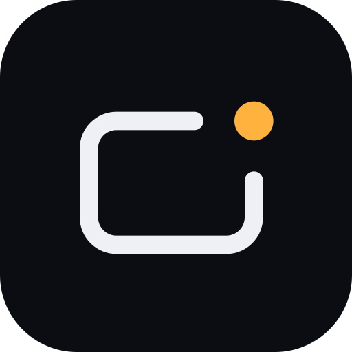

<div align="center">



# SkyScribe (myskyscribe)

**Control your PDF presentation slides with hand gestures. No mouse, no clicker, just air.**

Drop a PDF, raise your hand, and present — 100% in the browser, nothing ever leaves your machine.

<p>
  
  
  
  
  
</p>

</div>

---

## Overview

**SkyScribe** turns any PDF into a hands-free, gesture-controlled presentation. Drop a file in, and it becomes a full-screen presentation deck that you navigate with simple hand gestures in front of your webcam — no clicker, no mouse, and no assistant required.

It runs entirely **client-side** (no backend, no file uploads — your slides never leave your browser) and is designed for maximum speed, clarity, and reliability.

## Features

- 🖐️ **Real-time hand tracking** with MediaPipe Hand Landmarker, running in a dedicated Web Worker with main-thread fallback
- 📄 **Fast client-side PDF rendering** via `pdf.js` — pages decode directly to `ImageBitmap` with intelligent neighbor pre-caching
- ✌️ **Natural navigation gestures** — point index and middle fingers to the right for Next Slide, or to the left for Previous Slide
- ⌨️ **Complete keyboard fallback** — navigate seamlessly with Arrow keys (`←`/`→`), `Space`, `PgUp`/`PgDn`, or `Home`/`End`
- 🖥️ **Minimalist HUD & Fullscreen** — distraction-free slide counter, camera toggle, and fullscreen presentation mode
- 🔒 **100% Private & Local** — recent PDFs cached locally in IndexedDB, no analytics or telemetry

## Gesture Vocabulary

| Gesture | Action |
|---|---|
| ✌️ Two fingers pointing right | **Next Slide** — advance forward smoothly |
| ✌️ Two fingers pointing left | **Previous Slide** — return to previous slide |

## Keyboard Controls

Every action has an intuitive keyboard equivalent:

- `→` / `Space` / `Enter` / `PageDown` / `N`: Next slide
- `←` / `Backspace` / `PageUp` / `P`: Previous slide
- `Home`: Jump to slide 1
- `End`: Jump to last slide
- `F`: Toggle fullscreen
- `C`: Toggle camera tracking
- `Esc`: Exit presentation

## Tech Stack

| Layer | Choice |
|---|---|
| Build Tool | [Vite](https://vite.dev/) 8 |
| UI Framework | [React](https://react.dev/) 19 + [TypeScript](https://www.typescriptlang.org/) |
| Animations | [Motion](https://motion.dev/) |
| Hand Tracking | [`@mediapipe/tasks-vision`](https://developers.google.com/mediapipe) Hand Landmarker |
| PDF Engine | [`pdf.js`](https://mozilla.github.io/pdf.js/) |
| Unit Tests | [Vitest](https://vitest.dev/) |
| Deploy Target | [Vercel](https://vercel.com/) |

## Project Structure

```
myskyscribe/
├── brand/                  # Visual identity tokens and SVG icons
├── public/models/          # MediaPipe hand landmarker model
└── src/
    ├── App.tsx              # Main application router
    ├── main.tsx             # Application bootstrap
    ├── components/
    │   ├── Brand.tsx        # Logo and lockup components
    │   ├── GestureCards.tsx # Gesture guide cards
    │   ├── Home.tsx         # Drag-and-drop launcher & recent decks
    │   ├── Hud.tsx          # Minimal slide presentation HUD
    │   ├── Presenter.tsx    # Slide deck view and gesture navigation
    │   └── SlideCanvas.tsx  # High-DPI slide canvas renderer
    ├── hooks/
    │   └── useHandTracking.ts # React hook for MediaPipe worker
    ├── lib/
    │   ├── gestures.ts      # Gesture engine & pose classification
    │   ├── pdf.ts           # PDF loading & bitmap rendering
    │   ├── prefs.ts         # Local storage preferences
    │   ├── recent.ts        # IndexedDB deck persistence
    │   └── tracker.ts       # Camera & worker coordination
    ├── styles/
    │   └── app.css          # Design system & styles
    └── workers/
        └── hands.worker.ts  # Background hand tracking worker
```

## Getting Started

**Prerequisites:** Node.js `>= 20.19`

```bash
# Clone the repository
git clone https://github.com/Abhrxdip/SkyScribe.git
cd SkyScribe/myskyscribe

# Install dependencies
npm install

# Start development server
npm run dev

# Run automated test suite
npm test

# Build for production deployment
npm run build
```

## Privacy & Security

- **No backend, no upload** — your PDF and webcam stream are processed entirely on your local machine.
- **Camera permission is strictly local** — video frames are analyzed in-memory and never recorded or transmitted.
- **Local persistence only** — recent files and settings are saved in your browser's IndexedDB and localStorage.

---

<div align="center">
Made with 🖐️, ☕ and SkyScribe.
</div>
